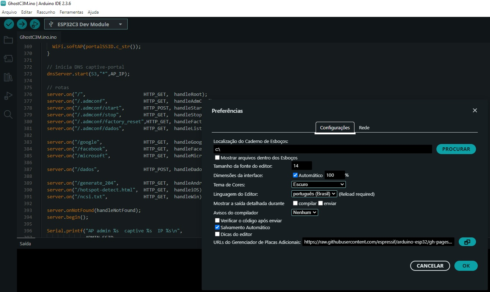

# GhostC3M

**GhostC3M** é um firmware voltado para ESP32‑C3 Mini, oferecendo uma alternativa simples e de baixo custo. Ele implementa um captive portal multi‑template (Google, Facebook e Microsoft) e inclui um painel administrativo seguro.


## Funcionalidades

- **AP de Administração**  
  Rede Wi-Fi `GhostC3M` (senha: `GhostC3M`) sempre ativa para administrar o dispositivo.

- **Captive Portal**  
  - Criação dinâmica de uma rede falsa (SSID configurável).  
  - Três modelos de portal de phishing:
    1. **Google** (com logo Product Sans e faixa colorida)  
    2. **Facebook**  
    3. **Microsoft** (logo em quadradinhos 2×2)
	
	

- **Painel Administrativo** (`/.admconf`)  
  - Iniciar e parar o captive portal sem reiniciar o ESP32.  
  - Visualizar histórico acumulado de e-mails e senhas capturados.  
  - Factory Reset (limpeza completa de credenciais e histórico).
	

- **Armazenamento em NVS**  (`/.admconf/dados`) 
  - Credenciais Wi-Fi (STA) para conexão a redes reais.  
  - SSID e template do portal ativo.  
  - Histórico acumulado de dados capturados.


- **Compatibilidade de captive portal**  
  - Redirecionamento automático para Android (`/generate_204`),  
  - iOS (`/hotspot-detect.html`) e  
  - Windows NCSI (`/ncsi.txt`).

## Estrutura de Rotas

| Rota                       | Método | Descrição                                        |
|----------------------------|--------|--------------------------------------------------|
| `/`                        | GET    | Redireciona para o portal ativo ou para `/\.admconf` |
| `/.admconf`                | GET    | Exibe painel administrativo                      |
| `/.admconf/start`          | POST   | Inicia captive portal com SSID/template fornecidos |
| `/.admconf/stop`           | GET    | Para o captive portal e restaura AP admin        |
| `/.admconf/factory_reset`  | GET    | Reseta NVS e limpa todas configurações e histórico |
| `/.admconf/dados`          | GET    | Exibe histórico de e-mails e senhas capturados   |
| `/google`                  | GET    | Página de phishing modelo Google                 |
| `/facebook`                | GET    | Página de phishing modelo Facebook               |
| `/microsoft`               | GET    | Página de phishing modelo Microsoft              |
| `/dados`                   | POST   | Recebe e armazena e-mail e senha                 |
| `/generate_204`            | GET    | Compatibilidade Android captive portal           |
| `/hotspot-detect.html`     | GET    | Compatibilidade iOS captive portal               |
| `/ncsi.txt`                | GET    | Compatibilidade Windows NCSI                     |
|----------------------------|--------|--------------------------------------------------|

## Modo de Uso

1. Conecte-se à rede Wi-Fi **GhostC3M** (senha: `GhostC3M`).  

2. Abra seu navegador em `http://192.168.4.1/.admconf`.  
3. No painel administrativo, defina:
   - **Portal SSID**: nome da rede falsa a ser criada  
   - **Modelo de Captive Portal**: Google, Facebook ou Microsoft  
   - Clique em **Iniciar Portal**.  
4. Saia da rede **GhostC3M** no seu dispositivo e reconecte na rede falsa recém-criada.  
5. Preencha o formulário de phishing (e-mail + senha).  
6. Os dados ficam armazenados e podem ser visualizados em `/.admconf/dados`.  
7. Para parar o portal sem reiniciar, acesse `/.admconf` e clique em **Parar Portal**.  
8. Para limpar tudo (credenciais, portal e histórico), clique em **Factory Reset**.

## Instalação

### A) Usando o Arduino IDE

1. **Instale o Arduino IDE**  
   - Se ainda não tiver, baixe em https://www.arduino.cc/en/software e instale.

2. **Adicione o suporte ao ESP32**  
   - Abra o Arduino IDE e vá em **Arquivo > Preferências**.  
   - Na caixa “URLs adicionais de Gerenciadores de Placas”, adicione:
     ```
     https://raw.githubusercontent.com/espressif/arduino-esp32/gh-pages/package_esp32_index.json
     ```
   - Clique em **OK**.


3. **Instale a placa ESP32-C3**  
   - Vá em **Ferramentas > Placa > Gerenciador de Placas…**  
   - Busque por “esp32” e instale o pacote da Espressif (Arduino-ESP32).  
   - Quando terminar, em **Ferramentas > Placas** escolha **ESP32C3 Dev Module** (ou “ESP32C3 Mini”).

4. **Configure porta e velocidade**  
   - Conecte o ESP32-C3 via USB ao PC.  
   - Em **Ferramentas > Porta**, selecione a porta serial (ex.: COM3 no Windows ou `/dev/ttyUSB0` no Linux).  
   - Em **Ferramentas > Upload Speed**, escolha **115200** (ou **921600**).

5. **Carregue o código**  
   - Abra um novo sketch em **Arquivo > Novo** e cole o código-fonte do GhostC3M.  
   - Clique em ✔️ **Verificar** para compilar.  
   - Em seguida, clique em → **Enviar** para fazer o upload.

6. **Monitore a saída**  
   - Abra o **Monitor Serial** em **Ferramentas > Monitor Serial**.  
   - Ajuste para **115200 baud**.  
   - Você deverá ver algo como:
     ```
     AP admin GhostC3M  captive (off)  IP 192.168.4.1
     ```

Agora o **GhostC3M** está em execução e pronto para ser configurado via `http://192.168.4.1/.admconf`.

## Licença

Este projeto está licenciado sob a **MIT License**. Veja o arquivo `LICENSE` para detalhes.  


## Disclaimer

Este projeto é disponibilizado exclusivamente para **fins educacionais e de pesquisa**. Nem o autor, nem os colaboradores ou mantenedores endossam, apoiam ou incentivam
o uso deste software para atividades ilícitas, escusas ou maliciosas. A responsabilidade pelo uso inadequado é inteiramente do usuário.

